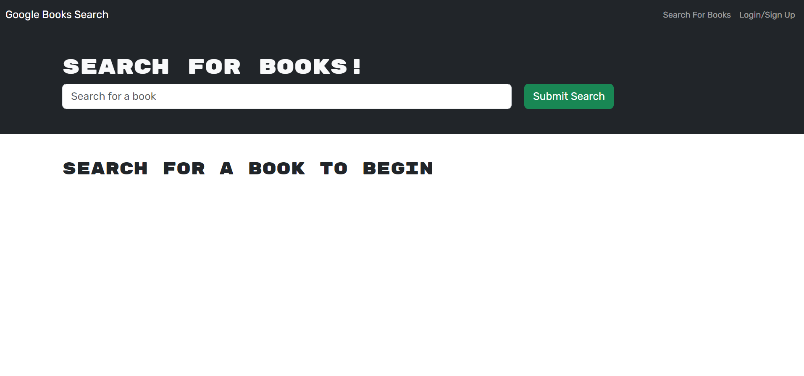
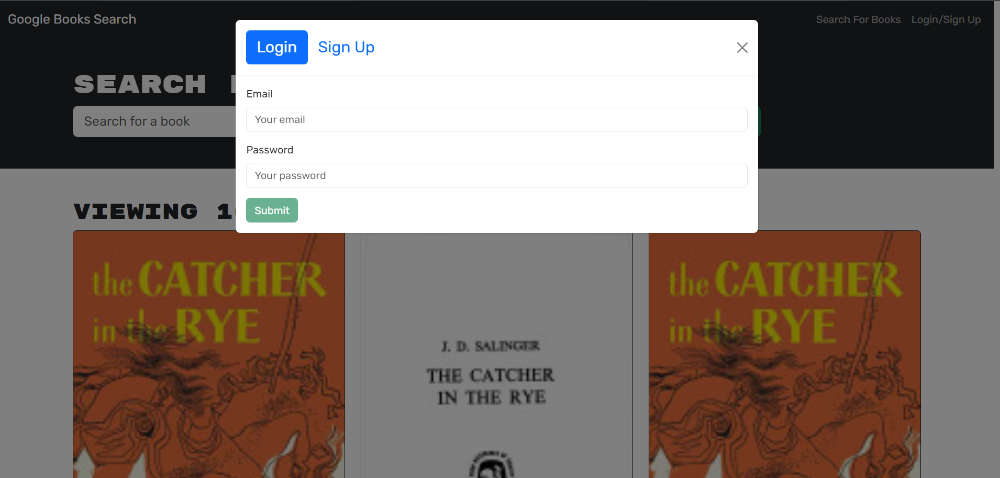
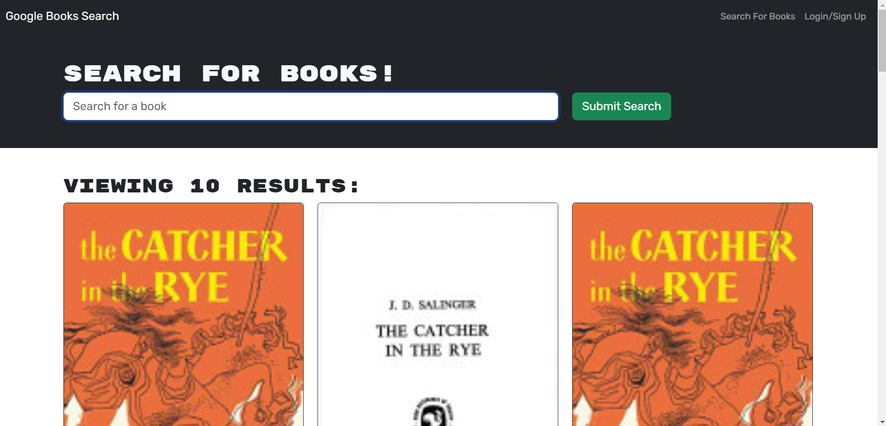
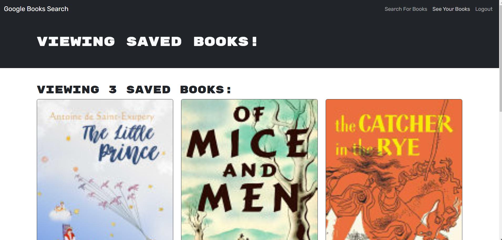

# MERN Book Search
## Description
The MERN Book Search lets user create a profile, search for books, save books, and delete books. 

## Table of Contents

[Installation](#installation)

[Usage](#usage)

[License](#license)

[Contribution](#contribution)

[Tests](#tests)

[Questions](#questions)

[Screenshots](#screenshots)

[Links](#links)

## Installation
Click the [link](https://mernsearch.onrender.com/).

## Usage
The user can create a profile by entering their username, email, and password. They can then search for a book and save their favorite books to their profile. Clickin on their profile lets them view all their saved books and delete individual books if desired.  

## License
This project is protected under the MIT license.

## Contribution
Fork my repo and send a pull request.

## Tests
Testing is currently being developed.

## Questions
For any questions or suggestions, please reach me at github.com/Levi-Man or at indra.levi.manahan@gmail.com.

## Screenshots
Homepage

Login

Search

Saved

## Links

Deployed site: https://mernsearch.onrender.com/

GitHub Repo: https://github.com/Levi-Man/MERN_BookSearch